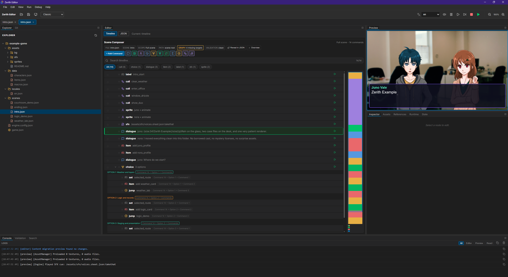

# Zerith

Zerith is a TypeScript monorepo for visual-novel style games: a reusable runtime core, a desktop authoring editor, and a static-site player/export pipeline.



The public docs are intentionally small. The source of truth is the code, package scripts, schemas, tests, fixture guard, and CI workflow.

## Packages

- `packages/core`: runtime engine, command schemas, content helpers, save/backlog/localization/story-graph utilities.
- `packages/editor`: Tauri + React desktop workbench for authoring projects, assets, localization, validation, export, Git, and plugins.
- `packages/player`: static runtime and build scripts for playable web exports.
- `games/classic-vn-starter`: canonical starter fixture for new-project and export flows.
- `games/example-game`: first-party showcase fixture used for example deploy/runtime coverage.

## Quick Start

```bash
npm ci
npm run dev:player
```

`npm run dev:player` launches the player against `games/classic-vn-starter`.

For the desktop editor:

```bash
npm run dev:editor
```

The editor uses Tauri, so local desktop development also needs the Rust/Tauri prerequisites for your platform.

## Build And Verify

```bash
npm run lint
npm test
npm run build
npm run test:fixture-policy
```

CI runs the fixture policy guard, lint, Vitest, CI-safe Playwright editor smoke, package builds, export parity smoke, and exported runtime smoke for the approved fixtures.

## Export A Game

```bash
npm run build:game -- --game=games/classic-vn-starter
npm run build:game:zip -- --game=games/classic-vn-starter
```

The player build defaults to portable relative asset paths for itch/subpath hosting. See `packages/player/README.md` for the export switches.

## Current Boundaries

- Use `games/classic-vn-starter` for starter flows and `games/example-game` for showcase/deploy flows.
- Browser editor parity, packaged desktop game export, plugin marketplace discovery, dual-site GitHub Pages deployment, and the full graph-canvas editor are planned but intentionally gated behind readiness checks.
- Keep new public documentation compact and backed by commands, schemas, tests, or generated/checkable facts.
